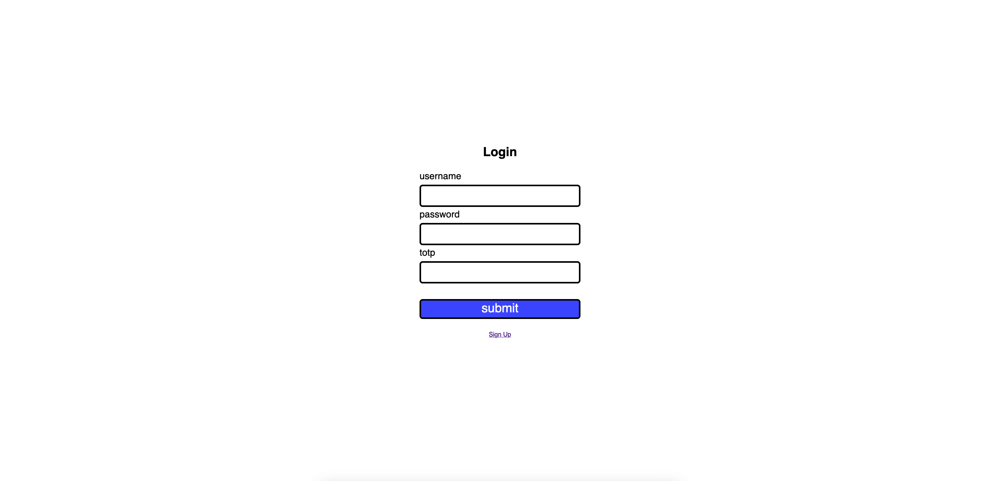

# Secure Notes App
Secure Notes App with 2FA, allowing user to write, publish and encrypt notes

## Main Functionality
- 2FA with TOTP
- Notes publication
- Notes encryption
- Notes creation
- Notes sanitization
- Password strength checker
- HTTPS

## Main Dependencies
- zxing _(qr code generation)_
- zxcvbn _(password entropy check)_
- httpclient _(easier url building)_
- bouncycastle _(argon2)_
- owasp java html sanitizer
- spring data jpa
- spring security
- thymeleaf

## Build
```
cd secure-notes-app
./gradlew bootJar
docker build -t security-app .
docker compose up
```

## Examples

### Login Page

### Signup Page

### Totp Qr Code

### Notes List

### New Note

### Note Example #1

### Note Example #2

### Note Example #3


## Features WIP
- Email verification for registration
- CSRF
- Password Change
- Localization
- Tests
- Better note editor

